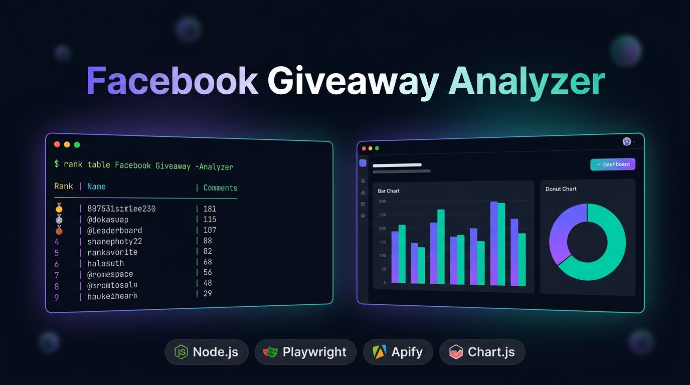

<div align="center">



# 🚀 Facebook Giveaway Analyzer

**A production-ready Node.js tool for scraping Facebook comments & analyzing giveaway contests**

[](https://anassaadhamad.github.io/FacebookScrapper)
[](https://nodejs.org)
[](https://playwright.dev)
[](https://apify.com)
[](LICENSE)

</div>

---

## 📌 What Is This?

A robust CLI tool that:
1. **Scrapes** thousands of comments from any Facebook Reel or Post
2. **Deduplicates** participants by unique Facebook user ID (not just name)
3. **Ranks** commenters by total entries and generates a leaderboard
4. **Exports** results to CSV, JSON, and displays an interactive terminal table
5. **Visualizes** everything in a [live web dashboard](https://anassaadhamad.github.io/FacebookScrapper) 📊

> **Built for**: Social media managers, giveaway organizers, and marketing agencies who need accurate, auditable winner selection.

---

## 🌐 Live Demo

**[→ View the Live Dashboard](https://anassaadhamad.github.io/FacebookScrapper)**

The dashboard shows real data from an actual scraping session:
- 🏆 Full leaderboard with rank badges and progress bars
- 📊 Bar chart & doughnut chart breakdowns
- 💬 Paginated comment feed with author filtering
- 📥 One-click CSV export

---

## ✨ Features

| Feature | Description |
|---|---|
| 🕵️ **Dual Scraping Engine** | Local Playwright Stealth browser + Apify Cloud API |
| 🔄 **Dynamic Content** | Handles infinite scroll, "View more", reply threads |
| 👤 **True Deduplication** | Groups by Facebook `author/id` — not just display name |
| 📊 **Web Dashboard** | Interactive leaderboard, charts, and comment feed |
| 📁 **Multi-format Export** | CSV (leaderboard + all comments) + JSON summary |
| 🔒 **Cookie Auth** | Pass session cookies to bypass login walls |
| 🖥️ **Rich CLI Output** | Colored terminal table with percentages |

---

## 🏗️ Architecture

```
FacebookScrapper/
├── index.js                    # CLI entry point (Commander.js)
├── src/
│   ├── scraper/
│   │   ├── playwrightScraper.js  # Stealth browser engine
│   │   └── apifyScraper.js       # Apify Cloud engine
│   ├── analyzer/
│   │   └── giveawayAnalyzer.js   # Deduplication + ranking logic
│   └── cli/
│       └── ui.js                 # Terminal table rendering (chalk + cli-table3)
├── dashboard/                  # 🌐 Live web dashboard (GitHub Pages)
│   ├── index.html
│   ├── style.css
│   ├── app.js
│   └── demo-data.json          # Real scraped data
└── results/                    # Output directory (CSV + JSON)
```

---

## ⚡ Quick Start

### 1. Install

```bash
git clone https://github.com/anassaadhamad/FacebookScrapper.git
cd FacebookScrapper
npm install
npx playwright install chromium
```

### 2. Run

```bash
# Basic scraping
node index.js --url "https://www.facebook.com/reel/REEL_ID" --max 500

# With session cookies (recommended for large threads)
node index.js --url "https://www.facebook.com/reel/REEL_ID" --max 2000 --cookies ./cookies.json

# Using Apify Cloud (for scale)
node index.js --url "https://www.facebook.com/reel/REEL_ID" --engine apify --apify-token "YOUR_TOKEN"
```

---

## ⚙️ CLI Options

| Flag | Short | Default | Description |
|---|---|---|---|
| `--url` | `-u` | *Required* | Target Facebook Reel or Post URL |
| `--max` | `-m` | `1000` | Max comments to extract |
| `--engine` | `-e` | `playwright` | `playwright` or `apify` |
| `--cookies` | `-c` | `./cookies.json` | Path to cookies file |
| `--headless` | `-h` | `true` | Run browser headless (`true`/`false`) |
| `--output` | `-o` | `./results` | Output directory for exports |
| `--top` | — | `20` | Top N entries shown in terminal |
| `--apify-token` | — | — | Apify API token |

---

## 📁 Output Files

Each run exports 3 files to `./results/`:

| File | Contents |
|---|---|
| `facebook_giveaway_leaderboard_<TIMESTAMP>.csv` | Rank, Author ID, Name, Comment Count, Profile URL |
| `facebook_giveaway_all_comments_<TIMESTAMP>.csv` | All raw comments with author, text, URL, date |
| `facebook_giveaway_summary_<TIMESTAMP>.json` | Complete structured JSON report |

---

## 🔧 Tech Stack

- **Runtime**: Node.js (ESM)
- **Scraping**: [Playwright](https://playwright.dev) + [playwright-extra](https://github.com/berstend/puppeteer-extra) stealth plugin
- **Cloud Scraping**: [Apify Client](https://docs.apify.com/api/client/js)
- **CLI**: [Commander.js](https://github.com/tj/commander.js), [Chalk](https://github.com/chalk/chalk), [cli-table3](https://github.com/cli-table/cli-table3)
- **Export**: [csv-writer](https://github.com/ryu1kn/csv-writer)
- **Dashboard**: Vanilla HTML/CSS/JS + [Chart.js](https://www.chartjs.org)

---

## 📄 License

MIT © [Anas Saad Hamad](https://github.com/anassaadhamad)
